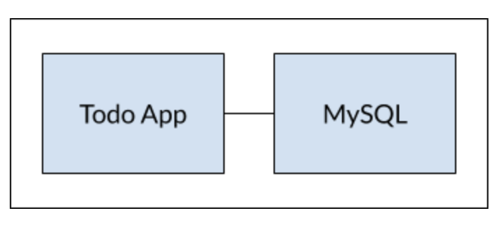
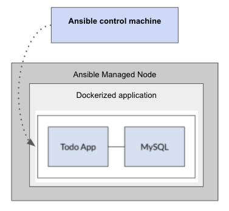

## Automation deployment of a todo sample application with __ansible__.

## What is this repository for? ###
#### With this repositiry you can easely automate a deployment for a "todo application" to a preexisting virtual machine.
#### There is no need for additional configuration or installing of any software, everithing will be confiigured and installed by the ansible playbook.

## Application architecture overview
#### The application consis of two tier app, the Web Tier (ToDo App) application container and the database tier application container (MySQL), where the Database is hosted. The database is only accessible from Web Tier.
#### Web Tier (Todo App) - Where  code is hosted. Front-end application is openly accessible over the internet.
#### That being said the application is will have a persistant database even after the efemeral containers restart.
#### We have an application that now stores its data in an external database running in a separate container.


## Ansible automation workflow overview


## Control Node requirements
#### For your control node (the machine that runs Ansible), please refer to this hyperlynk: [Installing Ansible on specific operating systems](https://docs.ansible.com/ansible/latest/installation_guide/intro_installation.html#id9)

## Managed Nodes requirements 
#### Note: currently only Debian-based Linux Distributions are supported by the ansible playbook 
#### Although you do not need a daemon on your managed nodes, you do need a way for Ansible to communicate with them. For most managed nodes, Ansible makes a connection over SSH and transfers modules using SFTP. If SSH works but SFTP is not available on some of your managed nodes, you can switch to SCP in ansible.cfg. For any machine or device that can run Python, you also need Python 2 (version 2.6 or later) or Python 3 (version 3.5 or later).

## how to run ansible playbook deployment?
1. clone the repository `git clone https://github.com/StefanMihail/ansible_todo_app.git`
2. after cloning the repository, update the __hosts.yaml__ file, hosts value with yout managed node public ip address. (if you prefer to access the application on a specific port you can update the application_port_mapping value to your desired needs, inside the __portvars.yaml__ file) otherwise we will access the application on the default port __3002__ 
3. change directory into the ansible_todo_app directory `cd ansible_todo_app`.
4. run the command  `ansible-playbook playbook.yaml`
5. waiti untill all the tasks are finished, you should see the below output at the end. 
6. Access the application on the following address: http://18.185.249.122:3002/ 

## Note:
Depending on your use case you might consider modifying the __hosts.yaml__ file contents in regards to connectivity detailes to the ansible managed node.
```
"ok":[ 18.185.249.122]"=>"{
  "output":{
    "actions":[
      
    ],
    "changed":false,
    "failed":false,
    "services":{
      "app":{
        "todo_app_app_1":{
          "cmd":[
            "sh",
            "-c",
            "yarn install && yarn run dev"
          ],
          "image":"node:12-alpine",
          "labels":{
            "com.docker.compose.config-hash":"3cee2ee9288470379b89ae07b5053a7ec6990e973fb08ff2f755d32792e5da6b",
            "com.docker.compose.container-number":"1",
            "com.docker.compose.oneoff":"False",
            "com.docker.compose.project":"todo_app",
            "com.docker.compose.project.config_files":"/tmp/ansiblej4r1d_91/docker-compose.yml",
            "com.docker.compose.project.working_dir":"/tmp/ansiblej4r1d_91",
            "com.docker.compose.service":"app",
            "com.docker.compose.version":"1.29.2"
          },
          "networks":{
            "todo_app_default":{
              "IPAddress":"172.18.0.3",
              "IPPrefixLen":16,
              "aliases":[
                "08061a044116",
                "app"
              ],
              "globalIPv6":"",
              "globalIPv6PrefixLen":0,
              "links":null,
              "macAddress":"02:42:ac:12:00:03"
            }
          },
          "state":{
            "running":true,
            "status":"running"
          }
        }
      },
      "mysql":{
        "todo_app_mysql_1":{
          "cmd":[
            "mysqld"
          ],
          "image":"mysql:5.7",
          "labels":{
            "com.docker.compose.config-hash":"66697a548ded3fe423cf08741156f5d9aee50bb6375770b878c997292bc3f378",
            "com.docker.compose.container-number":"1",
            "com.docker.compose.oneoff":"False",
            "com.docker.compose.project":"todo_app",
            "com.docker.compose.project.config_files":"/tmp/ansiblej4r1d_91/docker-compose.yml",
            "com.docker.compose.project.working_dir":"/tmp/ansiblej4r1d_91",
            "com.docker.compose.service":"mysql",
            "com.docker.compose.version":"1.29.2"
          },
          "networks":{
            "todo_app_default":{
              "IPAddress":"172.18.0.2",
              "IPPrefixLen":16,
              "aliases":[
                "2e5e5b465392",
                "mysql"
              ],
              "globalIPv6":"",
              "globalIPv6PrefixLen":0,
              "links":null,
              "macAddress":"02:42:ac:12:00:02"
            }
          },
          "state":{
            "running":true,
            "status":"running"
          }
        }
      }
    }
  }
}
```